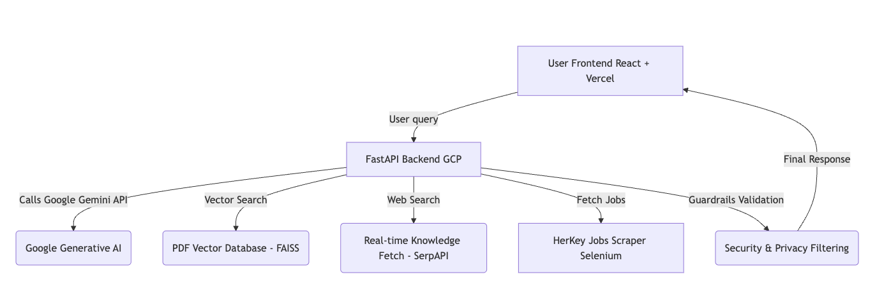
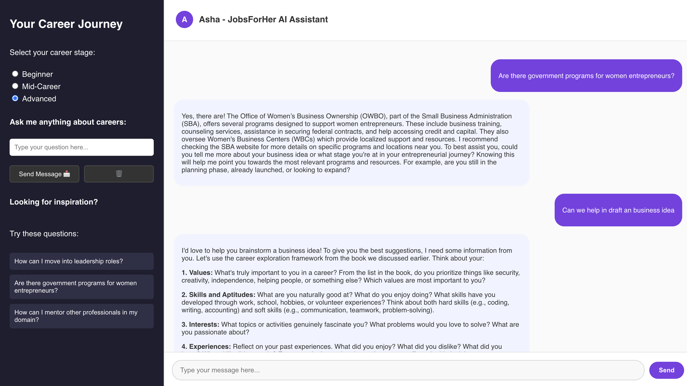
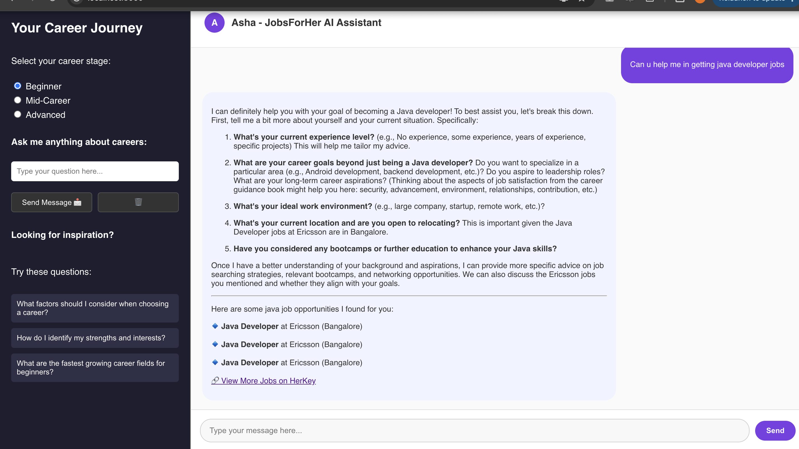
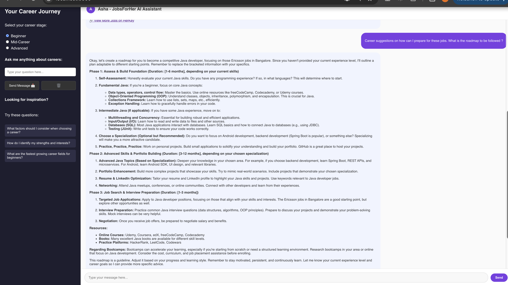

# 💬 Asha Career Guidance Chatbot

> **Empowering Women to Explore Careers with AI Assistance**  
> 🚀 Built for JobsForHer Foundation

---

## 🏛️ Architecture Overview


- **Frontend:** React.js + Vercel
- **Backend:** FastAPI + Uvicorn (GCP VM hosted)
- **LLM:** Google Gemini 1.5 Flash via LangChain
- **Knowledge Base:** FAISS Vector Store from Career PDFs
- **Web Knowledge:** SerpAPI Bing Search
- **Job Fetching:** HerKey.com Real-time Scraper (Selenium)
- **Safety:** Guardrails AI + Women-Focused Filters
- **Storage:** GCP Compute Engine, Vercel Frontend

---

## 🛠️ Technologies Used

| Technology  | Purpose |
|:------------|:--------|
| **React.js** | Responsive frontend UI |
| **TailwindCSS** | Styling (Optional) |
| **FastAPI** | Backend API Service |
| **Uvicorn** | ASGI Server |
| **LangChain** | LLM Orchestration |
| **Google Generative AI (Gemini)** | LLM Model |
| **FAISS** | Local Vector Search Database |
| **Selenium** | Real-time scraping HerKey jobs/events |
| **Guardrails AI** | Bias detection, safe responses |
| **Vercel** | Frontend Deployment |
| **GCP Compute Engine** | Backend Hosting |

---

## 📦 Folder Structure

```
├── frontend/
│   ├── src/
│   │   ├── Api.ts
│   │   ├── components/
│   ├── vercel.json
│   └── package.json
├── backend/
│   ├── main.py
│   ├── llm_engine.py
│   ├── pdf_loader.py
│   ├── job_fetcher.py
│   └── requirements.txt
├── .github/
│   └── workflows/
│       └── deploy.yml
├── README.md
└── .env.template
```

---

## 🚀 Setup Instructions

### Frontend Setup

```bash
cd frontend
npm install
npm run dev
```
- Runs at `http://localhost:3000/`

### Backend Setup

```bash
cd backend
pip install -r requirements.txt
uvicorn main:app --reload --host=0.0.0.0 --port=8000
```
- Runs at `http://localhost:8000/`

---

## 🔒 Environment Variables Required

| Variable | Description |
|:---------|:------------|
| `GOOGLE_API_KEY` | API Key for Gemini |
| `SERPAPI_API_KEY` | API Key for Web Search |
| `OPENAI_API_KEY` | (Optional) OpenAI Support |
| `PORT` | Port to run FastAPI |
| `PDF_DIRECTORY` | (Optional) PDF Location for loading |

---

## 🔗 Integration Process

| Integration | How it Works |
|:------------|:-------------|
| **Frontend to Backend** | Axios calls to `/api/ask` (via Vercel proxy) |
| **Backend to Gemini** | LangChain ChatGoogleGenerativeAI connector |
| **Web Knowledge Search** | SerpAPI Bing results dynamically |
| **Vector Search** | FAISS index search on custom PDFs |
| **Event/Jobs Fetching** | Selenium scraping from HerKey |
| **Guardrails** | Validates every LLM response for safe output |

---

## ⚡ Features

- ✅ Conversational Career Guidance
- ✅ Contextual Memory (past chats considered)
- ✅ Dynamic HerKey Job Listing Fetch
- ✅ Real-time Event Discovery
- ✅ Bias-free, Respectful Responses
- ✅ Fully Responsive and Accessible UI
- ✅ Safe Guardrails Filtering
- ✅ Deployment Ready for GCP + Vercel

---

## 📸 Demo Screenshots

| Chat Window | Career Suggestions | Job Listings |
|:------------|:--------------------|:-------------|
|  |  |  |

---
